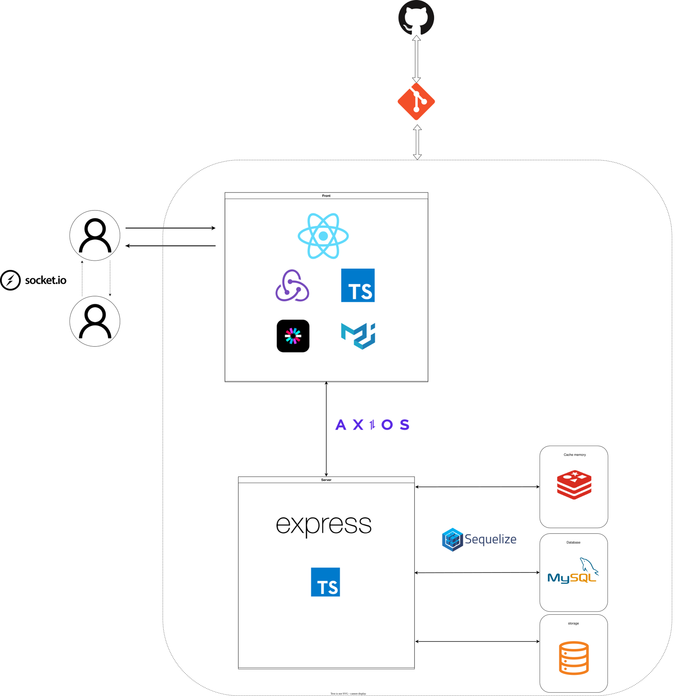

# 📘 SimSimTalk Backend

실시간 채팅 및 SNS 기능을 제공하는 백엔드 서버입니다.
Socket.io 기반 이벤트 아키텍처를 통해 채팅, 알림, 온라인 상태를 실시간으로 동기화하며,
멀티 디바이스 환경에서도 일관된 사용자 상태를 유지하도록 설계했습니다.

# 2. Tech Stack

Node.js + Express + TypeScript

Sequelize

MySQL

Redis

Socket.io

Cloudflare R2

# 3. Architecture / System Flow



# 4. Key Features

- HttpOnly Cookie JWT
- Socket.io realtime chatting
- Socket.io realtime alarms
- Redis Cache memories
- Suggested Self Join SQL
- Socket Authorization
- PairKey chatroom duplicate prevention

# 5. Database Design

https://www.erdcloud.com/d/w9njzRfzpWvDmivwm

# 6. API Overview

POST /auth/login
GET /auth/me
POST /posts
GET /chatrooms
POST /alarms/read

# 7. Socket Events

joinChatRoom
sendMessage
receiveMessage
loginJoinOnlineRoom
heartbeat
sendAlarm

# 8. Environment Variables

PORT=""

## cors

CORS_ORIGIN=""

## DB

DB_USERNAME=""
DB_PASSWORD=""
DB_DATABASE=""
DB_HOST=""
DB_DIALECT=""
DB_PORT=""

## JWT

SECRET_ACCTOKEN_KEY=""
SECRET_REFTOKEN_KEY=""
ACCTOKEN_EXPIRE=""
REFTOKEN_EXPIRE=""

## bcrypt

SALT_ROUND=10

## Redis

REDIS_HOST=""
REDIS_PORT=""
REDIS_PASSWORD=""
REDIS_NAME=""

## R2

R2_PUBLIC_URL=""
R2_END_POINT=""
R2_ACCESS_KEY_ID=""
R2_SECRET_ACCESS_KEY=""

R2_ACCOUNT_ID=""
R2_BUCKET_NAME=""

POST_DEFUALT_TTL=""

# 9. Getting Started

npm install
npm run dev

# 10. Deployment

Railway Server

Railway MySQL

Railway Redis

# 11. Troubleshooting

## 1) 유저 페이지 재방문 시 게시물이 로드되지 않는 문제 — 2025-11-06

### 이슈 상황

같은 유저 페이지에 연속으로 접속할 경우 게시물이 로드되지 않는 문제가 발생했다.
특히 홀수 번째 접속은 정상, 짝수 번째 접속은 빈 결과가 반환되는 패턴을 보였다.

### 증상

서버 요청 및 Redis 캐시는 정상 동작

페이지 진입 직후 isLast = true 상태가 됨

postLastId가 이전 방문의 마지막 게시물 ID를 유지

서버가 “마지막 페이지”로 판단하여 게시물을 반환하지 않음

### 원인 분석

유저 페이지 이탈 후 재진입 과정에서 다음 타이밍 문제가 발생했다.

Redux store의 getUserPostDatas를 페이지 진입 시 초기화

그러나 초기화 완료 전에 postLastId가 먼저 계산됨

React 렌더 타이밍과 상태 비동기 갱신 타이밍 불일치 발생

이전 페이지의 마지막 게시물 ID가 서버로 전달됨

```
let postLastId =
getUserPostDatas[getUserPostDatas.length - 1]?.id ?? null;
```

결과적으로 서버는 이미 마지막 페이지까지 조회된 것으로 판단했다.

### 시도한 해결 방법

resetPosts 시 isLast까지 초기화 → 실패

페이지 진입 시 posts 배열 강제 초기화 → 실패

렌더/상태 갱신 타이밍 경쟁 조건 지속

### 해결 방법

유저 페이지 상태 초기화 시점을 페이지 진입 시점 → 페이지 이탈 시점(unmount) 으로 변경했다.

이를 통해:

다음 페이지 진입 전에 store가 완전히 초기화됨

첫 렌더에서 postLastId = null 보장

pagination 상태 일관성 확보

### 회고

React 상태 초기화는 “언제 초기화할 것인가”가 중요하다.
페이지 진입 시 초기화는 렌더 타이밍과 경쟁할 수 있으며,
페이지 이탈 시 cleanup이 더 안전한 상태 초기화 전략이 될 수 있다.

## 2) Access Token 재발급 시 Redis 캐시 불일치 문제 — 2025-11-07

### 이슈 상황

Access Token이 만료되어 Refresh Token으로 재발급을 시도할 때,
토큰은 정상적으로 발급되지만 인증된 유저 정보를 가져오지 못하는 문제가 발생했다.

### 증상

Refresh Token은 유효하고 Access Token도 재발급됨

Redis에 캐싱된 유저 정보 조회 결과가 null

요청 쿠키의 Access Token 값과 Redis 캐시 키가 불일치

### 원인 분석

로그인 시 Access Token을 키로 하여 Redis에 유저 정보를 캐싱하고 있었다.

그러나 Access Token 재발급 시:

새로운 Access Token이 생성됨

Redis 캐시 키는 여전히 이전 Access Token 유지

이후 요청에서 새 토큰으로 Redis 조회

캐시 미스 발생 → 유저 정보 null

즉, 토큰 재발급 시 캐시 키 동기화가 누락된 상태였다.

### 해결 방법

Access Token 재발급 로직에 캐시 갱신을 추가했다.

기존 Access Token 키 캐시 삭제

새 Access Token 키로 유저 정보 재캐싱

이를 통해 토큰과 캐시 키가 항상 일치하도록 보장했다.

### 회고

토큰 기반 캐싱 구조에서는
“토큰 재발급 시 캐시 동기화”가 반드시 필요하다.

인증 상태와 캐시 키의 생명주기를 함께 관리해야 함을 학습했다.

## 3) 첫 로그인 시 소켓 온라인 이벤트 미수신 문제 — 2026-01-19

### 이슈 상황

서버를 최초 실행한 후 첫 로그인 시,
유저 온라인 상태가 표시되지 않는 문제가 발생했다.
이후 로그인부터는 정상 동작했다.

### 증상

로그인 성공 후 loginJoinOnlineRoom 이벤트 전송

서버에서 해당 소켓 이벤트 미수신

소켓 연결 자체는 존재

프론트 로그에서 socket.id = undefined 확인

### 원인 분석

로그인 시 소켓 재연결(reconnect) 로직이 비동기로 실행되며
소켓 연결 완료 전에 이벤트가 전송되고 있었다.

기존 흐름:

reconnectSocket() 호출

즉시 loginJoinOnlineRoom 이벤트 전송

소켓 아직 연결 전 상태

서버 미수신

즉, 소켓 연결 완료 보장 없이 이벤트를 전송하는 타이밍 문제였다.

### 해결 방법

소켓 connect 이벤트 이후에 로그인 이벤트를 전송하도록 수정했다.

```
socket.disconnect();
socket.connect();

socket.once("connect", () => {
  loginSocket(userId);
});
```

이를 통해 소켓 연결이 완료된 상태에서만
온라인 이벤트가 전송되도록 보장했다.

### 회고

WebSocket은 단순 이벤트 채널이 아니라
“연결 상태 기반 비동기 시스템”이다.

이벤트 전송 시점은 연결 완료 이후로 보장해야 하며,
소켓 lifecycle을 고려한 설계가 필요함을 학습했다.

# 🚧 Future Improvements

## Phase 1 – Mobile & Responsive Optimization

모바일 사용 비중이 높은 SNS 특성을 고려하여
반응형 UI 최적화를 우선 진행할 계획입니다.

### 1) 모바일 레이아웃 재구성

### 2) 터치 친화적 인터랙션 개선

### 3) 작은 화면에서의 피드 가독성 개선

### 4) 채팅 UI 모바일 최적화
